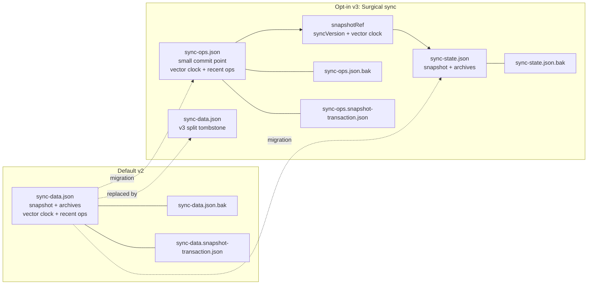
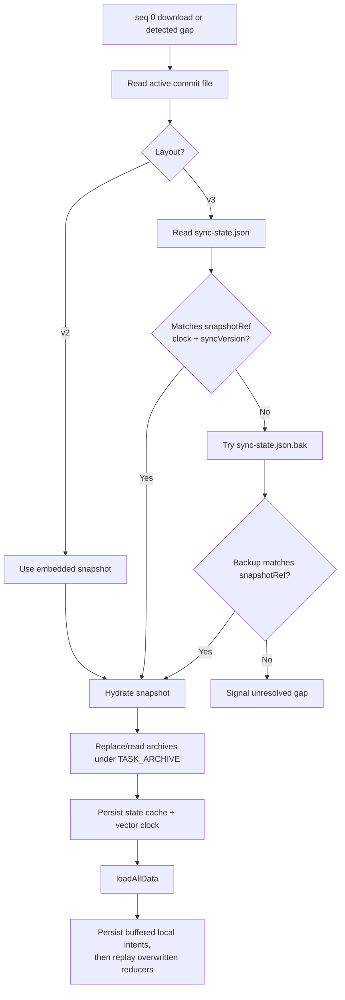

# File-Based Sync Architecture

**Last Updated:** July 2026

**Status:** Implemented

This reference describes file-based operation sync for Dropbox, OneDrive,
WebDAV/Nextcloud, and Local File. For the end-to-end decision tree, see
[file-based-sync-flowchart.md](../file-based-sync-flowchart.md).

## Remote Layouts

File-based sync supports two layouts. The default remains the version 2 single
file. Version 3, exposed as **Surgical sync**, is opt-in and is a one-way
migration for a sync folder.



| Property      | Default v2                        | Opt-in v3                                                                |
| ------------- | --------------------------------- | ------------------------------------------------------------------------ |
| Hot file      | `sync-data.json`                  | `sync-ops.json`                                                          |
| Snapshot      | Embedded in every hot-file upload | `sync-state.json`, rewritten for compaction or authoritative replacement |
| Recent-op cap | 2,000                             | Grows to 2,000, then compacts to 1,000                                   |
| Commit point  | `sync-data.json` revision         | `sync-ops.json` revision                                                 |
| Compatibility | Default                           | Every client for the folder must enable Surgical sync                    |

The transport envelope types and permanent file names live in
`packages/sync-providers/src/file-based-sync-data.ts`.

## Ordinary Sync

```mermaid
sequenceDiagram
    participant App as OperationLogSyncService
    participant Adapter as FileBasedSyncAdapterService
    participant Remote as File provider

    App->>Adapter: downloadOps(sinceSeq)
    Adapter->>Remote: read active commit file
    Remote-->>Adapter: payload + revision
    Adapter-->>App: unseen ops, or snapshot on seq 0/gap
    App->>App: validate and apply remote work
    App->>Adapter: uploadOps(local ops)
    Adapter->>Adapter: merge and increment syncVersion
    Adapter->>Remote: conditional upload(revision)
    alt revision still current
        Remote-->>Adapter: new revision
        Adapter-->>App: success
    else another writer won
        Remote-->>Adapter: revision mismatch
        Adapter->>Remote: re-download
        Adapter-->>App: abort current attempt; next sync downloads and merges
    end
```

There is no file-provider “piggybacking” response. When a conditional write
loses, the adapter discovers the winner's operations by re-downloading the
active commit file.

## Conditional Write Contract

Every `FileSyncProvider` implements the same `uploadFile` contract:

| Call                     | Required behavior                             |
| ------------------------ | --------------------------------------------- |
| `revToMatch: "revision"` | Replace only that exact revision.             |
| `revToMatch: null`       | Create only if the file is absent.            |
| `isForceOverwrite: true` | Intentionally replace without a precondition. |

Dropbox maps this to atomic update/add modes. OneDrive uses `If-Match` or
`conflictBehavior=fail`. WebDAV uses `If-Match` for strong ETags and
`If-None-Match: *` for creation. Weak/missing WebDAV ETags fall back to a
GET-and-content-hash check, which cannot close the GET-to-PUT race. Local File
has the same single-writer limitation.

## Snapshot and Gap Path



File snapshot bootstrap does not create a `SYNC_IMPORT`; it retains ordinary
causality. Explicit Use Local/Use Remote and backup-import flows still use their
full-state operation semantics.

## Split Compaction and Recovery

For v3 compaction, `sync-state.json` is backed up and conditionally written
before `sync-ops.json` is changed to reference it. If the process stops between
the two writes, readers keep using the previous ops commit point and recover the
matching previous state from `sync-state.json.bak`.

A structurally corrupt primary state may be healed from the backup only when the
backup matches `snapshotRef`. Healing conditionally matches the corrupt
primary's own revision; a newer valid but unreferenced state is not overwritten.

Authoritative snapshot replacement is separately crash-serialized. A durable
pending transaction contains the exact encoded snapshot payloads (both state and
ops in v3), then the adapter publishes the bound files before conditionally
marking that same transaction complete. Startup/download completes a pending
transaction before ordinary sync, and ordinary backup rotation verifies that the
observed marker revision is unchanged. The completed marker keeps compact
SHA-256 bindings plus the published revisions, allowing recovery to reject a
stale backup written by a marker-unaware client. Replacement intent is never
guessed from vector-clock order.

```mermaid
sequenceDiagram
    participant A as Compactor A
    participant B as Compactor B
    participant R as Remote storage

    A->>R: read state rev S1
    B->>R: read state rev S1
    A->>R: backup S1
    A->>R: write new state if S1
    R-->>A: state rev S2
    A->>R: write ops if O1, snapshotRef=S2
    B->>R: write new state if S1
    R-->>B: mismatch; re-download/retry
```

## One-Way v2 to v3 Migration

Migration uses a crash-resumable pending marker:

1. conditionally create or replace a pending `sync-ops.json` candidate;
2. conditionally write `sync-state.json`;
3. neutralize `sync-data.json.bak` and conditionally replace the v2 primary with
   a v3 split tombstone;
4. conditionally protect the recovery backup and finalize the ops marker.

The required ops backup is revision- and causality-owned. A stale migrator must
not overwrite a newer or concurrent backup before losing the primary CAS.

## Browser WebDAV Requirements

Browser WebDAV must allow `GET`, `PUT`, `DELETE`, `MKCOL`, `PROPFIND`, and
`OPTIONS`; accept `Authorization`, `Cache-Control`, `Content-Type`, `Depth`,
`If-Match`, and `If-None-Match`; and expose `ETag`. See
`docs/wiki/2.09-Configure-Sync-Backend.md` for user-facing setup guidance.

## Key Files

| File                                                                          | Responsibility                                                                  |
| ----------------------------------------------------------------------------- | ------------------------------------------------------------------------------- |
| `src/app/op-log/sync-providers/file-based/file-based-sync-adapter.service.ts` | Layout selection, migration, recovery, merge, compaction, and conditional retry |
| `packages/sync-providers/src/file-based-sync-data.ts`                         | Provider-neutral v2/v3 envelopes and constants                                  |
| `packages/sync-providers/src/provider-types.ts`                               | `FileSyncProvider` conditional-write contract                                   |
| `src/app/op-log/persistence/sync-hydration.service.ts`                        | Snapshot/archive hydration and durable state cache                              |
| `src/app/op-log/sync/operation-log-sync.service.ts`                           | Local/remote orchestration and conflict handling                                |
