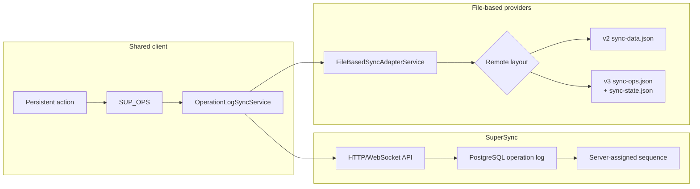
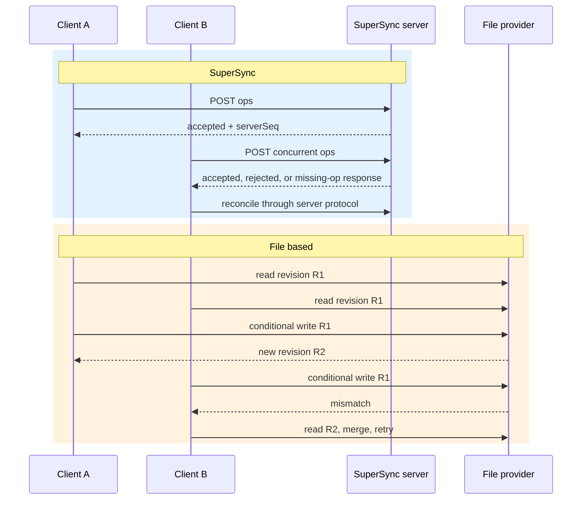
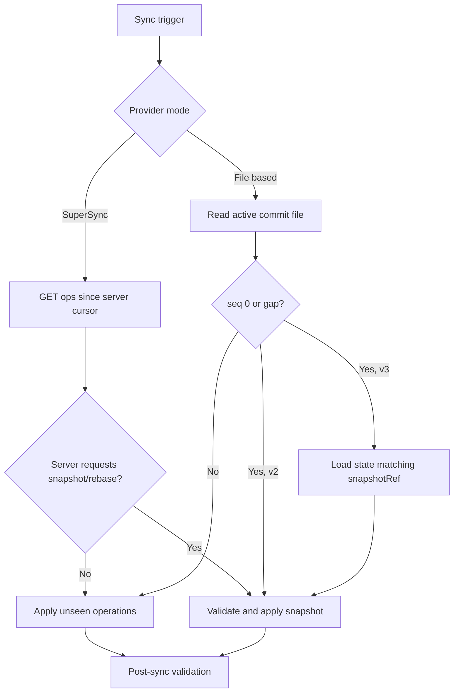

# SuperSync vs File-Based Sync

**Last Updated:** July 2026

**Status:** Implemented

Both transports use the same local operation log, vector clocks, replay rules,
validation, and conflict UI. They differ in where remote ordering and atomicity
live.

## Architecture

File-based providers are Dropbox, OneDrive, WebDAV/Nextcloud, and Local File.
Version 2 is the default. Version 3 is the opt-in Surgical sync layout and is a
one-way migration for a folder.

## Comparison

| Aspect | SuperSync | File based |
| --- | --- | --- |
| Remote source of truth | Server operation table and snapshots | Active remote commit file: v2 `sync-data.json` or v3 `sync-ops.json` |
| Ordering | Server-assigned sequence | Client `syncVersion` plus retained compact operations |
| Ordinary download | Paginated operations since cursor; optional WebSocket trigger | Read whole active commit file, filter retained ops locally |
| Ordinary upload | POST operation batch | Download/merge/conditionally rewrite active commit file |
| Snapshot | Server snapshot/import path | Embedded in v2; referenced `sync-state.json` in v3 |
| Concurrency guard | Server transaction and conflict response | Provider-side revision precondition; retry after re-download |
| Gap detection | Server cursor/snapshot protocol | Retained-op boundary, version reset/replacement, and v3 `snapshotRef` validation |
| Storage efficiency | Operations plus server compaction | v2 rewrites snapshot each sync; v3 usually rewrites only the ops file |
| Live trigger | WebSocket | Timer/manual/provider polling |
| Self-hosting | Dedicated SuperSync service | Any compatible storage provider |

## Upload Concurrency

File providers do not return piggybacked operations from an upload. The losing
writer learns concurrent work by re-downloading after the revision mismatch.

## File-Provider Guarantees

`FileSyncProvider.uploadFile` defines:

- string `revToMatch`: replace only that revision;
- `null`: create only if absent;
- force overwrite: intentional unconditional replacement.

Dropbox and OneDrive offer atomic service-side preconditions. WebDAV is atomic
when the server supplies strong ETags; weak/missing ETags use a best-effort
content check. Local File is single-writer. The shared operation rules cannot
compensate for a transport that permits two conditional writers to overwrite
each other.

## Download and Snapshot Flow

File snapshot hydration writes downloaded archives under `TASK_ARCHIVE`, saves
the state cache and merged clock before `loadAllData`, then persists/replays
local actions that were accepted during the hydration window.

## Choosing a Transport

This is a product/configuration decision, not a difference in local data
ownership: every mode remains local-first and works offline.

- SuperSync is appropriate when real-time triggers, server-managed ordering,
  and multi-device concurrency are worth operating or trusting a dedicated
  service.
- Dropbox/OneDrive are appropriate when a managed file API is preferred.
- WebDAV/Nextcloud are appropriate for user-controlled storage; browser clients
  additionally require complete CORS and ETag configuration.
- Local File is for a single device or manual backup target, not a folder
  mirrored concurrently by another sync tool.

## Key Files

| Area | Files |
| --- | --- |
| Shared orchestration | `src/app/op-log/sync/operation-log-sync.service.ts`, `remote-ops-processing.service.ts` |
| File adapter | `src/app/op-log/sync-providers/file-based/file-based-sync-adapter.service.ts` |
| Provider contract | `packages/sync-providers/src/provider-types.ts` |
| SuperSync client | `packages/sync-providers/src/super-sync/` |
| SuperSync server | `packages/super-sync-server/` |
