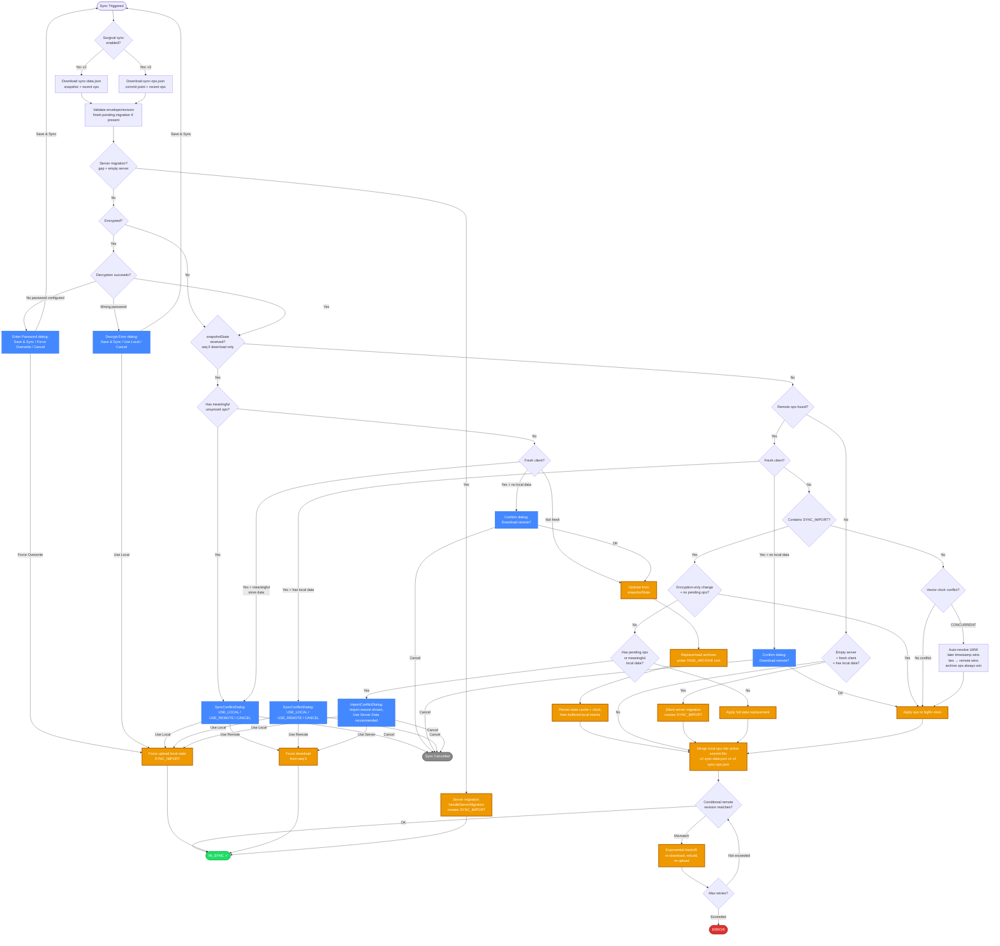
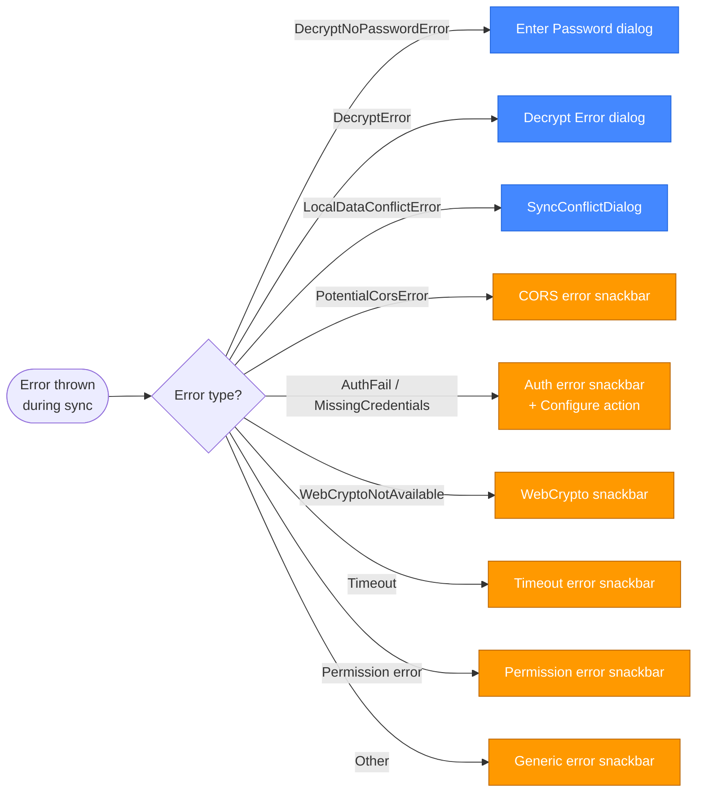

# File-Based Sync Flow — Mermaid Chart

Visual overview of the sync decision tree for file-based providers (Dropbox, OneDrive, WebDAV/Nextcloud, and Local File). For the SuperSync equivalent see [supersync-scenarios-flowchart.md](./supersync-scenarios-flowchart.md).

Both share the same op-log infrastructure (`OperationLogSyncService`, `RemoteOpsProcessingService`, conflict detection) but differ in the transport/adapter layer.

## Error Handling (SyncWrapperService)

Errors thrown during sync are caught by `SyncWrapperService._sync()`. File-based providers surface additional error types not seen with SuperSync:

**Legend:**

- 🟢 Green = success states
- 🔴 Red = error states
- 🔵 Blue = user-facing dialogs
- 🟠 Orange = key actions (state changes, uploads, downloads)
- ⚫ Gray = cancelled/disabled

## Key Differences from SuperSync

| Aspect                          | File-Based (Dropbox, WebDAV, LocalFile)                                                                 | SuperSync                                         |
| ------------------------------- | ------------------------------------------------------------------------------------------------------- | ------------------------------------------------- |
| **Transport**                   | Default v2 `sync-data.json`, or opt-in v3 `sync-ops.json` + `sync-state.json`                           | Paginated API (server-side op log)                |
| **Snapshot path**               | Full `snapshotState` on seq 0 download, with its own conflict-checking flow                             | No snapshot concept — all ops are incremental     |
| **Gap detection**               | Adapter detects syncVersion reset / snapshot replacement / partial trimming → re-download from seq 0    | Server handles gap detection internally           |
| **Server migration**            | Gap on empty server → `needsFullStateUpload` → `handleServerMigration()`                                | Same concept but detected via different mechanism |
| **Upload retry**                | Provider-side revision matching + exponential backoff with jitter                                       | Server rejection codes (`CONFLICT_CONCURRENT`)    |
| **Piggybacking**                | Not applicable — no server to piggyback. Concurrent changes are discovered on re-download during retry. | Server returns piggybacked ops in upload response |
| **Post-sync encryption prompt** | Not applicable                                                                                          | Prompts user to set password or disable sync      |
| **File-based error types**      | `PotentialCorsError`, `LegacySyncFormatDetectedError`, `SyncDataCorruptedError`                         | Not applicable                                    |

## Notes

- The `Enter Password` and `Decrypt Error` dialogs correspond to `DecryptNoPasswordError` and `DecryptError` respectively — they are shared with SuperSync and are distinct components with different options.
- `Encryption-only change` bypass: when an incoming SYNC_IMPORT has `syncImportReason === 'PASSWORD_CHANGED'` and there are no meaningful pending ops, the dialog is skipped (data is identical, only encryption changed).
- LWW tie-breaking: on equal timestamps, remote wins (server-authoritative). `moveToArchive` operations always win regardless of timestamp.
- Default v2 keeps at most 2,000 recent operations. Opt-in v3 compacts only after that cap is exceeded, writes `sync-state.json` first, and trims `sync-ops.json` to 1,000 operations.
- Gap detection triggers include a syncVersion reset, snapshot replacement, and `oldestOpSyncVersion > sinceSeq`. A v3 seq-0/gap read also requires `sync-state.json` to match the ops file's `snapshotRef`.
- Upload retry uses exponential backoff: `base × 2^(attempt-1) + random(0..50%)` with max retries defined by `FILE_BASED_SYNC_CONSTANTS.MAX_UPLOAD_RETRIES`.
- `revToMatch: null` means create-if-absent; a string means replace that exact revision; force overwrite is reserved for explicit authoritative replacement.

## Key Source Files

| File                                                                          | Role                                                                     |
| ----------------------------------------------------------------------------- | ------------------------------------------------------------------------ |
| `src/app/imex/sync/sync-wrapper.service.ts`                                   | Top-level orchestration + error handling                                 |
| `src/app/op-log/sync/operation-log-sync.service.ts`                           | Download/upload orchestration, fresh client checks, SYNC_IMPORT handling |
| `src/app/op-log/sync/operation-log-download.service.ts`                       | Download + internal gap detection                                        |
| `src/app/op-log/sync-providers/file-based/file-based-sync-adapter.service.ts` | File adapter (rev matching, gap detection, snapshot upload)              |
