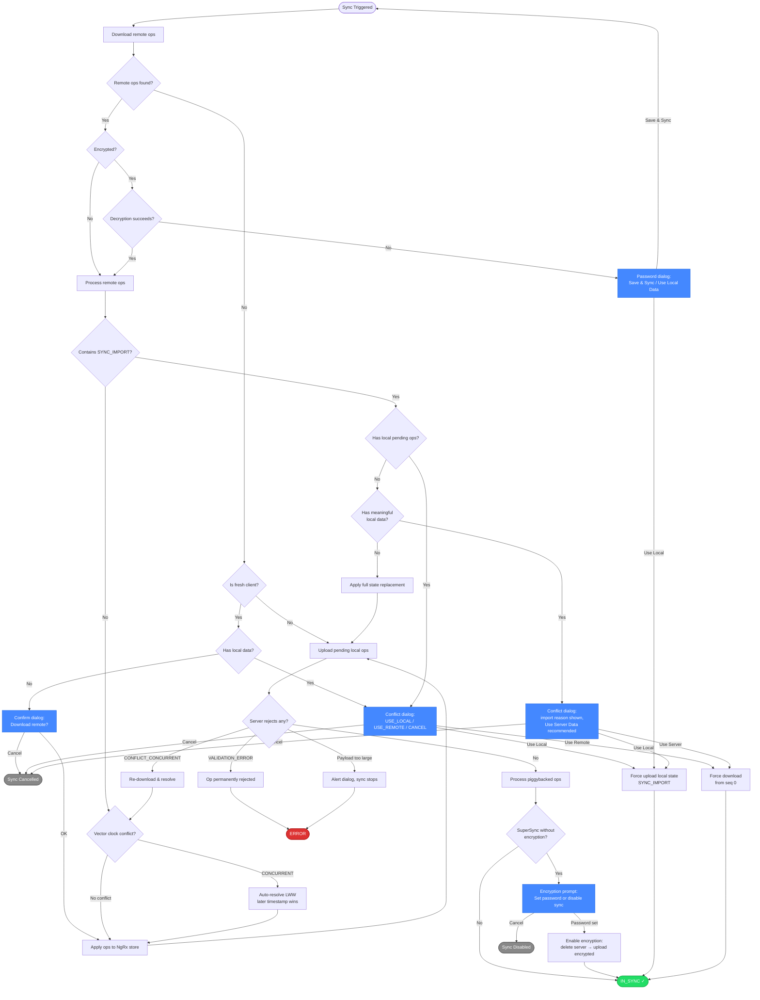

# SuperSync Sync Flow — Mermaid Chart

Visual overview of the main sync decision tree. For full details see [supersync-scenarios.md](./supersync-scenarios.md).

**Legend:**

- 🟢 Green = success states
- 🔴 Red = error states
- 🔵 Blue = user-facing dialogs
- ⚫ Gray = cancelled/disabled
